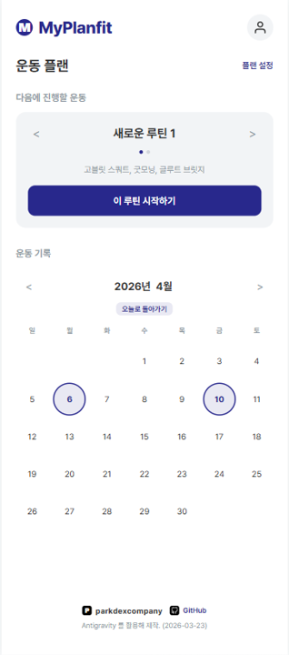
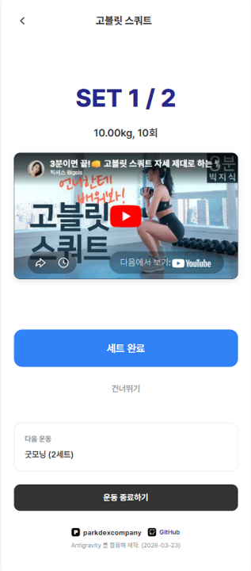
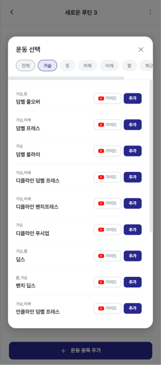

# MyPlanfit

MyPlanfit is a goal-oriented workout management application designed to help users create custom workout routines and track their progress effectively.

> [!NOTE]
> **Disclaimer:** This project is a personal toy project created for testing and learning purposes, mimicking the original service [Planfit](https://planfit.ai/ko).
> 
> **원본 서비스 안내:** 본 프로젝트는 운동 루틴 관리 서비스인 [Planfit](https://planfit.ai/ko)을 모방하여 테스트 및 학습용으로 제작된 개인 토이 프로젝트입니다.

---

## Live Demo
Check out the latest version here: [MyPlanfit Test Server](https://myplanfit-65988077346.asia-northeast3.run.app/)

---

## Screenshots & Features

### 1. Signup Process

- **Step-by-Step UI**: Implements a smooth, multi-step signup form progressing from Email Input ➔ OTP Verification ➔ Nickname & Password Setup.
- **Email Verification (OTP)**: Sends a secure 6-digit verification code via REST API, complemented by a 5-minute client-side countdown timer for secure authentication.
- **UX Optimization**: Features real-time input validation, visual success/error feedback alerts, and proactive tooltips such as CapsLock detection during password input.

### 2. Home Dashboard

- **Day Plan Slider**: Displays a horizontally swipeable slider (`.DayPlanSlider`) of user-created workout routines, allowing users to start their sessions immediately.
- **Workout History Calendar**: Visually highlights completed workout dates on an interactable calendar (`checkedDates`). Clicking a specific date displays a detailed history log of the session.
- **Persistent Authentication**: Dynamically fetches and renders the user's profile information securely using JWT tokens stored securely in the browser's local storage.

### 3. Workout Progress

- **Real-time Tracker**: Clearly indicates the current set number, target weight (kg), and reps. Controls workout progression through standard "Complete" and "Skip" state actions.
- **Embedded Video Guides**: Uses Regex to automatically extract video IDs from YouTube URLs, seamlessly embedding a responsive iframe guide directly inside the view.
- **Dynamic State Calculation**: Instantly identifies pending target sets (`PENDING`) and dynamically recalculates the imminent next exercises on any state changes, smoothly auto-advancing the UI.

### 4. Plan Editor

- **Hierarchical Management**: Empowers users to search and assign multiple exercise categories to a single daily plan, with granular control over generating and editing individual target sets.
- **Smart Set Formatting**: Eliminates repetitive data entry workflows by automatically copying the previous set's target weight and rep numbers when initializing a new set (`defaultWeight`, `defaultReps`).
- **Interactive Modals & Focus States**: Integrates a targeted exercise selection modal and incorporates smooth window auto-scrolling animations (`scrollIntoView`, `smooth`) that gracefully track newly appended DOM elements.

---

## Core Features
- **Structured Planning:** Create multi-layered workout plans (Day > Exercise > Sets).
- **Exercise Library:** Categorized body parts with integrated YouTube video guides.
- **Smart Tracking:** Automatically carries over weight and reps from previous sets for efficient logging.
- **Progress Calendar:** Visualize consistency and view detailed historical logs by clicking on specific dates.
- **Motivational Feedback:** Real-time progress tracking and completion rewards.

## Technical Stack
- **Frontend:** React (Vite)
- **Backend:** Node.js, Express
- **Database:** MySQL (Google Cloud SQL)
- **Infrastructure:** Google Cloud Platform (Cloud Run)
- **Security:** JWT Authentication, Rate Limiting, CORS, and Helmet integration.

## Project Structure
- `src/client`: React frontend application.
- `src/server`: Node.js Express backend API.

## Architecture Highlights
- **Hierarchical Data Model:** `Plan` → `Day` → `Exercise` → `Set`
- **Security First:** Implemented request validation and rate limiting to ensure stable cloud deployment.
- **Automation:** Includes scripts for exercise video link validation and management.

 

Original service: https://planfit.ai/ko